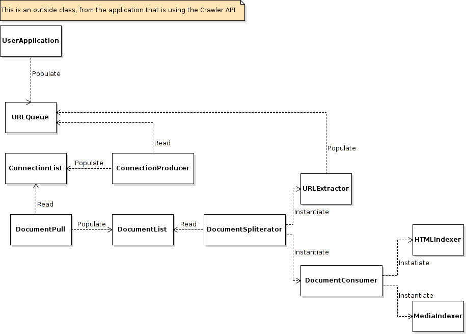

# Efficacious Duck

A component based Web Crawler API for scraping purposes.

The components:

#[DocumentPull](src/br/com/efficacious/dom/DocumentPull.java)
#[DocumentSpliterator](src/br/com/efficacious/dom/DocumentSpliterator.java)
#[DocumentConsumer](src/br/com/efficacious/url/DocumentConsumer.java)
#[ConnectionProducer](src/br/com/efficacious/connection/ConnectionProducer.java)

